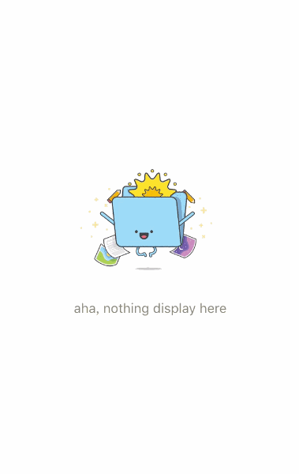
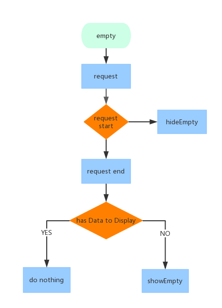
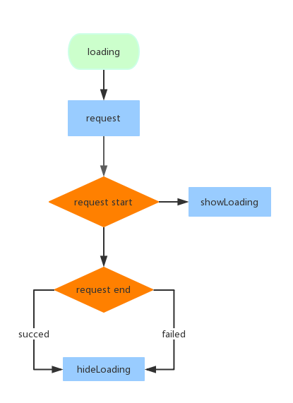
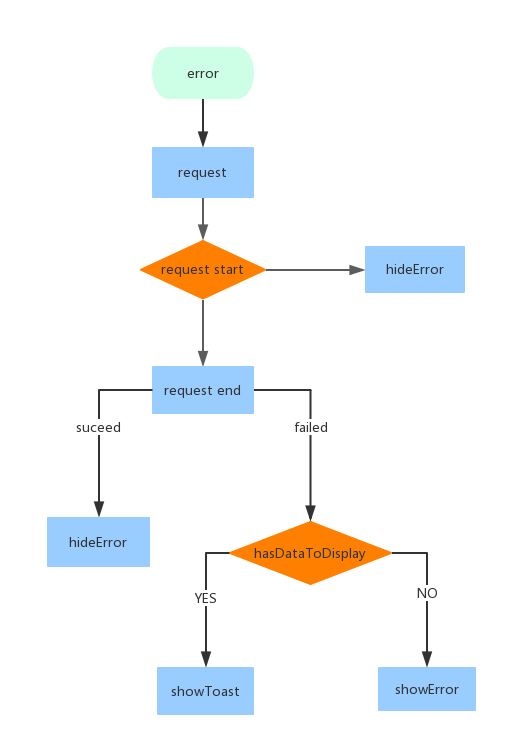
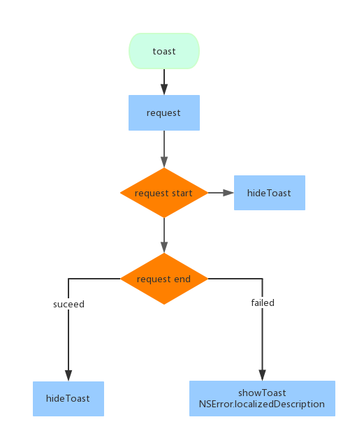

# PromptKit
show Loading、error、empty with RACSignal



# appearance
### global appearance
- set `PKPromtView`background color

 ```
 [[PKPromptView appearance] setBackgroundColor:[UIColor lightGrayColor]];
 ```
 - set global empty title 、 empty icon

 ```
 PKSetting *pkDefault     = [PKSetting Default];
 pkDefault.empty.title    = @"oops, there is nothing";
 pkDefault.empty.iconName = @"global_empty_logo";
 ```

 - set global error title、error icon

 ```
 pkDefault.error.title    = @"something wrong";
 pkDefault.error.iconName = @"global_error_logo";
 pkDefault.error.btnTitle = @"tap to refresh";
 ```

 - set action button style

 ```
 pkDefault.style.actionBtn.titleLabel.font = [UIFont systemFontOfSize:15.0f]];
 [pkDefault.style.actionBtn setBackgroundImage:[UIImage imageNamed:@"prompt_action_normal"] forState:UIControlStateNormal];
 ```


# empty
### empty flows

### how to use
```
PKPromptUIDataSource *empty = [[PKPromptUIDataSource alloc] initWithTitle:emptyTitle logo:@"empty_logo_name"];
RACSignal *signal = ...
id<PKEmptyViewProtocol> del = ...
[[signal pk_addLoading: del] subscribeNext:^(id x) {
       //signal next
}];
```
# loading
-------------------
### loading flows

### how to use
```
RACSignal *signal = ...
id<PKLoadingViewProtocol> del = ...
[[signal pk_addLoading: del] subscribeNext:^(id x) {
       //signal next
}];
```

# error
### error flows

### how to use
``` Objective-C
RACSignal *signal = ...;

id<PKErrorViewProtocol> del = ...;

[[signal pk_observerError:del reload:^{
	// action execute by tap button or view to reload when error occure

}] subscribeNext:^(id x) {
	// next of signal
}];
```

# toast
### toast flows

### how to use
```
RACSignal *signal = ...;

id<PKErrorToastProtocol> del = ...;

[[signal pk_observerErrorToast:del] subscribeNext:^(id x) {
	// next of signal
}];
```
